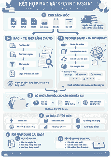
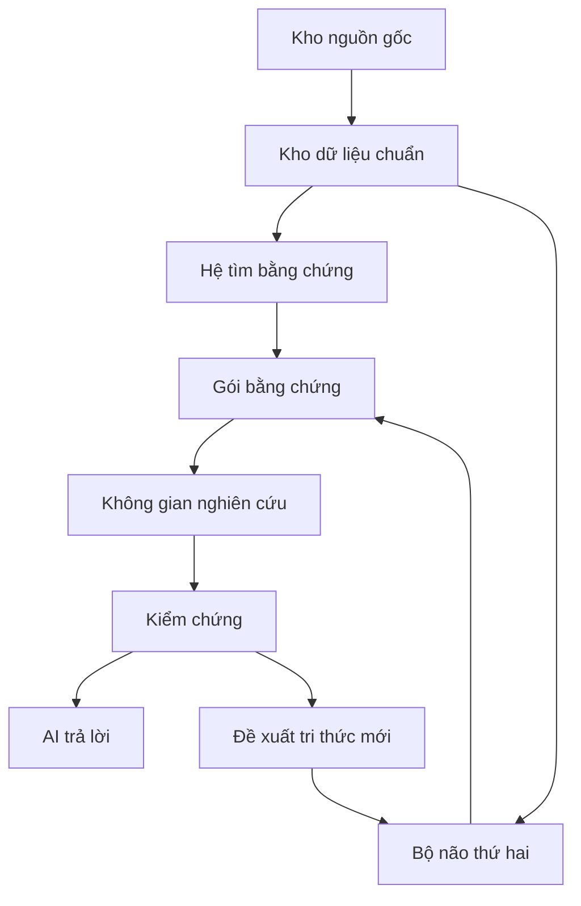

# Thư Viện Sống AI

**Phiên bản tài liệu 1.0**

> Nền tảng tri thức kết hợp **thư viện số có cấu trúc + hệ tìm bằng chứng + Bộ não thứ hai + không gian nghiên cứu**, nhằm giúp AI đọc, tìm, kiểm chứng, tổng hợp và ghi nhớ tri thức từ kho tài liệu lớn mà vẫn truy ngược được về nguồn.



## Đọc tài liệu nào trước?

### Muốn hiểu toàn bộ dự án

👉 **[Đọc Tài liệu tổng thể phiên bản 1.0](docs/00-TAI-LIEU-TONG-THE-V1.0.md)**

Đây là tài liệu chính. Một người chưa biết gì về dự án chỉ cần đọc tài liệu này từ đầu đến cuối để nắm gần như toàn bộ kiến trúc, lý do lựa chọn và cách các thành phần phối hợp.

### Chỉ có vài phút

👉 [Tóm tắt một trang](docs/00-tom-tat-mot-trang.md)

## 1. Dự án này xây cái gì?

Không phải chỉ là một phần mềm hỏi đáp PDF.

Không phải chỉ là một wiki tự động.

Mục tiêu là xây:

> **một nền tảng tri thức có thể sống qua nhiều thế hệ AI: nguồn gốc được bảo tồn, bằng chứng có thể tìm và kiểm chứng, hiểu biết được tích lũy, còn các công cụ bên ngoài có thể thay thế.**

## 2. Kiến trúc cốt lõi



Có thể hiểu ngắn gọn:

- **Kho nguồn gốc** = sự thật và bằng chứng ban đầu.
- **Hệ tìm bằng chứng** = tìm đúng sách, chương, trang và đoạn.
- **Bộ não thứ hai** = giữ những gì đã hiểu và đã được kiểm chứng.
- **Không gian nghiên cứu** = bàn làm việc tạm cho một câu hỏi khó.

## 3. Mười nguyên tắc cần nhớ

1. **AI không phải là nguồn.**
2. **Nguồn gốc không được AI sửa.**
3. **Kho dữ liệu chuẩn phải sống lâu hơn mọi công cụ.**
4. **Mọi khẳng định quan trọng phải truy ngược được về bằng chứng.**
5. **Một kết quả tìm được chưa tự động là bằng chứng.**
6. **Một trích dẫn có thật chưa chắc chứng minh được khẳng định.**
7. **Không đủ bằng chứng là một kết quả hợp lệ.**
8. **RAG giữ trí nhớ bằng chứng; Bộ não thứ hai giữ trí nhớ hiểu biết.**
9. **Tri thức mới chỉ được ghi nhớ sau khi qua kiểm chứng.**
10. **Công cụ mới chỉ được thay thế khi vượt bộ kiểm thử trên dữ liệu thật.**

## 4. Điểm khác biệt chính

```text
NGUỒN BẤT BIẾN
        ↓
KHO DỮ LIỆU CHUẨN
        ↓
HAI LOẠI TRÍ NHỚ
    │
    ├── bằng chứng
    └── hiểu biết
        ↓
ĐỌC THEO ĐỘ SÂU THÍCH ỨNG
        ↓
GÓI BẰNG CHỨNG
        ↓
AI NGHIÊN CỨU
        ↓
KIỂM CHỨNG
        ↓
TRI THỨC TỐT
        ↓
BỘ NÃO THỨ HAI
```

## 5. Công nghệ chỉ là các bộ máy có thể thay

Các lựa chọn hiện tại có thể gồm Docling, PaddleOCR, Qdrant, RAGFlow, QMD, PageIndex và các công cụ khác.

Nhưng nguyên tắc là:

> **không công cụ bên ngoài nào được sở hữu dữ liệu cốt lõi của Thư Viện Sống.**

Nếu một ngày bỏ RAGFlow, kho sách vẫn còn.

Nếu bỏ QMD, Markdown vẫn còn.

Nếu bỏ PageIndex, cấu trúc sách vẫn còn.

## 6. Bộ tài liệu chuyên sâu

### Nền tảng

- [Tài liệu tổng thể phiên bản 1.0](docs/00-TAI-LIEU-TONG-THE-V1.0.md)
- [Tóm tắt một trang](docs/00-tom-tat-mot-trang.md)
- [Bài toán, mục tiêu và nguyên tắc nền tảng](docs/01-bai-toan-va-muc-tieu.md)

### Dữ liệu và tìm kiếm

- [Số hóa và kho dữ liệu chuẩn](docs/02-so-hoa-va-chuan-hoa-nguon.md)
- [Hệ tìm bằng chứng, RAG và đọc phân tầng](docs/03-kien-truc-rag.md)
- [Bộ não thứ hai](docs/04-second-brain.md)
- [Kiến trúc hợp nhất](docs/05-kien-truc-hop-nhat.md)

### Thiết kế kỹ thuật

- [Vai trò các công cụ và dự án tham khảo](docs/06-nghien-cuu-repo-tham-khao.md)
- [Mô hình dữ liệu và truy nguồn](docs/07-mo-hinh-du-lieu.md)
- [Giao diện cho AI và MCP](docs/08-giao-dien-ai-mcp.md)
- [Đánh giá chất lượng](docs/09-danh-gia-chat-luong.md)
- [Lộ trình triển khai](docs/10-lo-trinh-trien-khai.md)
- [Các quyết định kiến trúc](docs/11-quyet-dinh-kien-truc.md)
- [Từ điển thuật ngữ](docs/12-thuat-ngu.md)
- [Tài liệu và dự án tham khảo](docs/13-tai-lieu-tham-khao.md)
- [Cấu trúc repo kỹ thuật](docs/14-cau-truc-repo-ky-thuat.md)
- [Chế độ nghiên cứu nghiêm ngặt](docs/15-che-do-nghien-cuu-nghiem-ngat.md)

### Kiểm soát thất lạc tri thức

- [Bảng kiểm bảo toàn ý tưởng phiên bản 1.0](docs/_kiem-ke/bao-toan-y-tuong-v1.0.md)

## 7. Những điều cố ý chưa làm ở bản đầu

- Không nhận dạng chữ từ ảnh toàn bộ PDF.
- Không chỉ dùng tìm kiếm véc-tơ.
- Không xây đồ thị tri thức toàn kho ngay lập tức.
- Không dùng huấn luyện lại mô hình để thay hệ tìm bằng chứng.
- Không cho nhiều tác tử cùng sửa trực tiếp Bộ não thứ hai.
- Không cho kết quả nghiên cứu chưa kiểm chứng đi thẳng vào trí nhớ lâu dài.
- Không phụ thuộc một repo bên ngoài duy nhất.

## 8. Thứ tự ưu tiên

```text
1. Đúng nguồn
2. Đúng cấu trúc
3. Đúng trang
4. Tìm đúng
5. Trích dẫn đúng
6. Giảm lượng chữ AI phải đọc
7. Tích lũy hiểu biết
8. Tự động hóa
9. Đồ thị và tính năng nâng cao
```

## 9. Một câu để nhớ

> **RAG giúp tìm đúng bằng chứng. Bộ não thứ hai giúp không phải học lại từ đầu. Sách gốc luôn là trọng tài cuối cùng.**
