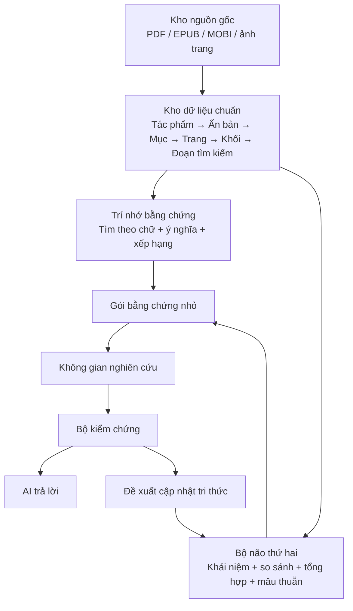

# Thư Viện Sống AI

**Phiên bản 1.0**

> Nền tảng tri thức kết hợp **thư viện số có cấu trúc + RAG (tìm bằng chứng) + Bộ não thứ hai (tích lũy hiểu biết) + không gian nghiên cứu tạm thời**, nhằm giúp AI đọc, tìm, kiểm chứng, tổng hợp và ghi nhớ tri thức từ kho sách lớn với chi phí thấp và khả năng thay thế công nghệ lâu dài.

## 1. Tầm nhìn

Mục tiêu của dự án không phải tạo thêm một ứng dụng “hỏi đáp PDF”. Mục tiêu là xây một **hệ điều hành tri thức** có thể sống nhiều năm, trong đó:

- tài liệu gốc luôn được giữ nguyên và có thể kiểm chứng;
- PDF, EPUB, MOBI được số hoá thành một mô hình dữ liệu chuẩn;
- hệ thống tìm đúng sách, đúng chương, đúng đoạn, đúng trang;
- AI chỉ đọc lượng thông tin tối thiểu cần thiết cho từng câu hỏi;
- kết quả nghiên cứu tốt không mất đi mà được chắt lọc vào **Bộ não thứ hai**;
- mọi khẳng định quan trọng đều có thể truy ngược về nguồn;
- các động cơ như RAGFlow, QMD, PageIndex, LightRAG có thể thay thế mà không làm mất “bộ não” của hệ thống.

## 2. Kiến trúc cốt lõi

Có thể hiểu ngắn gọn:

- **Kho nguồn gốc** = sự thật và bằng chứng.
- **RAG** = tìm đúng thứ cần đọc.
- **Bộ não thứ hai** = giữ những gì AI đã hiểu và đã được kiểm chứng.
- **Không gian nghiên cứu** = bàn làm việc tạm thời cho một vấn đề cụ thể.

## 3. Quyết định kiến trúc quan trọng nhất

Dự án **không lấy RAGFlow, Obsidian, Qdrant hay bất kỳ sản phẩm bên ngoài nào làm chủ dữ liệu**.

Dữ liệu chuẩn, lịch sử nguồn, sổ khẳng định và Bộ não thứ hai thuộc về dự án này. Các dự án bên ngoài chỉ là **động cơ cắm thêm**, có thể thay thế.

Đây là nguyên tắc giúp hệ thống không bị khoá vào một công nghệ và có thể tồn tại qua nhiều thế hệ AI.

## 4. Bộ công cụ đề xuất cho phiên bản đầu

| Nhiệm vụ | Công cụ đề xuất |
|---|---|
| Đọc PDF/EPUB có cấu trúc | Docling, PyMuPDF |
| Chuyển MOBI | Calibre |
| Nhận dạng chữ trang quét | PP-OCRv6 |
| Trang khó, bố cục phức tạp | PaddleOCR-VL |
| Cơ sở dữ liệu thông tin | PostgreSQL |
| Kho tìm kiếm theo ý nghĩa | Qdrant hoặc RAGFlow qua bộ chuyển tiếp |
| Mô hình biểu diễn ý nghĩa | Qwen3-Embedding-0.6B |
| Mô hình xếp hạng lại | Qwen3-Reranker-0.6B |
| Tìm trong Bộ não thứ hai | QMD |
| Bộ não thứ hai | Markdown + Git |
| Đọc sâu một cuốn dài | PageIndex, dùng khi cần |
| Giao diện cho AI | MCP + HTTP |
| Giao diện người dùng | Web; Obsidian chỉ là một lựa chọn đọc Markdown |

## 5. Những điều cố ý KHÔNG làm ở bản đầu

- Không OCR tất cả PDF.
- Không cắt sách thành các khối cố định theo số ký tự.
- Không dùng chỉ tìm kiếm véc-tơ.
- Không xây đồ thị tri thức toàn kho ngay lập tức.
- Không huấn luyện lại mô hình AI bằng toàn bộ kho sách để thay cho RAG.
- Không cho nhiều tác tử AI cùng sửa trực tiếp Bộ não thứ hai.
- Không xem bản tóm tắt của AI là nguồn chân lý.
- Không phụ thuộc vào một repo bên ngoài duy nhất.

## 6. Cấu trúc tài liệu

- [Tóm tắt một trang](docs/00-tom-tat-mot-trang.md)
- [Bài toán và mục tiêu](docs/01-bai-toan-va-muc-tieu.md)
- [Số hoá và chuẩn hoá nguồn](docs/02-so-hoa-va-chuan-hoa-nguon.md)
- [Kiến trúc RAG](docs/03-kien-truc-rag.md)
- [Bộ não thứ hai](docs/04-second-brain.md)
- [Kiến trúc hợp nhất](docs/05-kien-truc-hop-nhat.md)
- [Nghiên cứu các repo tham khảo](docs/06-nghien-cuu-repo-tham-khao.md)
- [Mô hình dữ liệu và truy nguồn](docs/07-mo-hinh-du-lieu.md)
- [Giao diện cho AI và MCP](docs/08-giao-dien-ai-mcp.md)
- [Đánh giá chất lượng](docs/09-danh-gia-chat-luong.md)
- [Lộ trình triển khai](docs/10-lo-trinh-trien-khai.md)
- [Các quyết định kiến trúc](docs/11-quyet-dinh-kien-truc.md)
- [Từ điển thuật ngữ](docs/12-thuat-ngu.md)
- [Tài liệu và repo tham khảo](docs/13-tai-lieu-tham-khao.md)

## 7. Trạng thái phiên bản 1.0

Phiên bản 1.0 là **bản đặc tả nghiên cứu và kiến trúc**, tổng hợp toàn bộ các quyết định quan trọng trước khi bắt đầu viết hệ thống sản xuất.

Nó cố ý ưu tiên làm rõ:

1. cái gì là dữ liệu cốt lõi;
2. cái gì có thể thay thế;
3. bằng chứng và hiểu biết phải được tách thế nào;
4. AI được phép đọc, suy luận và ghi lại tri thức theo quy trình nào;
5. cách giữ chi phí xử lý và lượng chữ gửi vào mô hình ở mức thấp.

## 8. Nguyên tắc một câu

> **Hãy để RAG làm thủ thư tìm đúng bằng chứng, để Bộ não thứ hai làm học giả tích lũy hiểu biết, và luôn giữ sách gốc làm trọng tài cuối cùng.**
