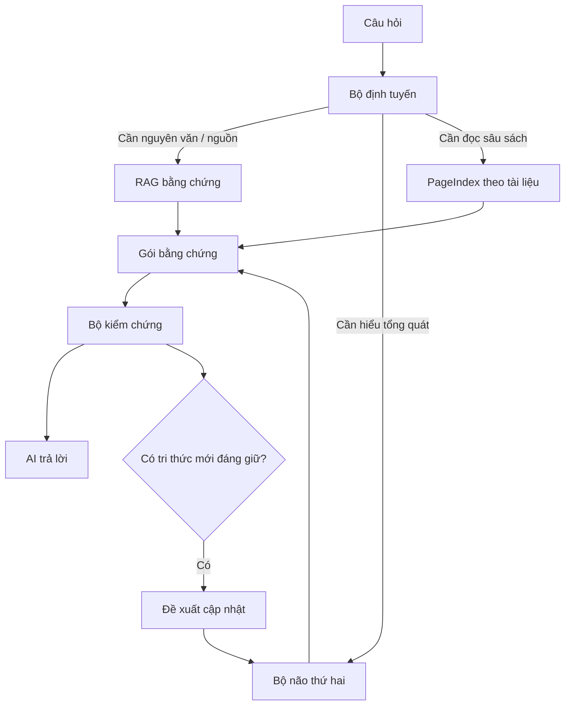

# 5. Kiến trúc hợp nhất RAG + Bộ não thứ hai

## 5.1. Hai loại trí nhớ

### Trí nhớ bằng chứng

Trả lời:

> “Nguồn nào, trang nào, đoạn nào chứng minh điều này?”

### Trí nhớ hiểu biết

Trả lời:

> “Chúng ta đã hiểu và tổng hợp gì về vấn đề này?”

Hai lớp không được trộn thành một thứ.

## 5.2. Luồng câu hỏi

## 5.3. Bộ định tuyến ý định

Ví dụ:

- “Câu X xuất hiện ở đâu?” → ưu tiên tìm theo chữ.
- “Tác giả A giải thích X thế nào?” → tìm kết hợp + xếp hạng.
- “So sánh 30 sách về X” → Bộ não thứ hai trước, sau đó tìm bằng chứng bổ sung.
- “Đọc kỹ chương này” → PageIndex hoặc cấu trúc chương/mục.

Không chạy mọi động cơ cho mọi câu hỏi.

## 5.4. Tách hai chỉ mục

### Chỉ mục kho sách

Lớn, tối ưu cho bằng chứng và trang.

### Chỉ mục Bộ não thứ hai

Nhỏ hơn, tối ưu cho trang Markdown đã tổng hợp.

Câu “ta biết gì?” và câu “ta biết điều đó từ đâu?” đi qua hai đường khác nhau.

## 5.5. Ranh giới tự viết và dùng lại

### Không tự viết lại

- OCR;
- PDF parser;
- vector database;
- embedding model;
- reranker;
- PageIndex;
- QMD;
- graph engine.

### Tự viết

- mô hình dữ liệu chuẩn;
- truy nguồn;
- bộ định tuyến;
- sổ khẳng định;
- trình biên dịch Bộ não thứ hai;
- giao dịch cập nhật wiki;
- bộ kiểm thử;
- MCP cấp cao thống nhất.

Đây là phần tạo giá trị lâu dài của repo.

## 5.6. Nguyên tắc thay thế động cơ

Mọi động cơ phải đứng sau một giao diện riêng của dự án.

Ví dụ `search_library()` có thể hôm nay gọi Qdrant, mai gọi RAGFlow mà tác tử AI không cần biết.
